## ABI LAB WORK

# Simulate New C Program With Function Call

# 1ton_custom.c

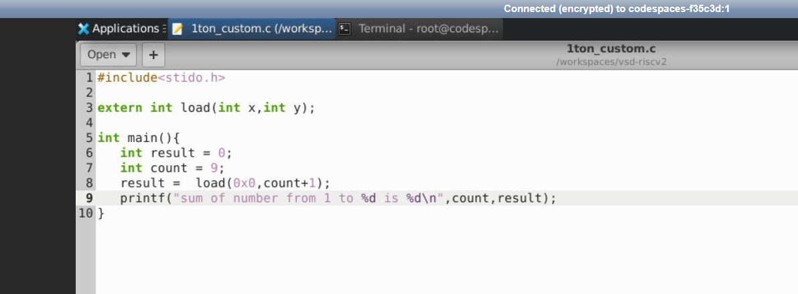

# load.s

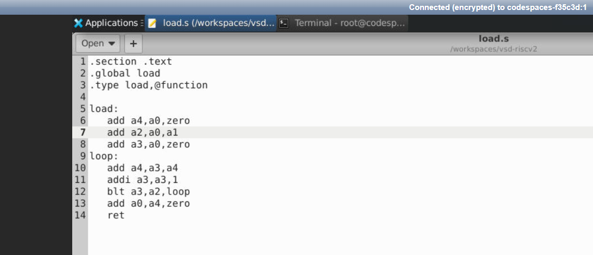

# Compiling and output of the above programs using riscv compiler

  
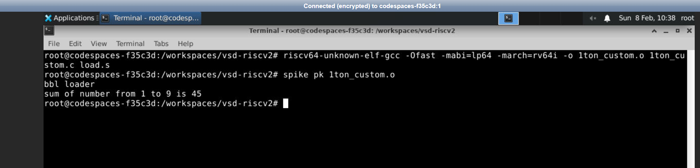

# These lines are written to get the assembly code of the above program

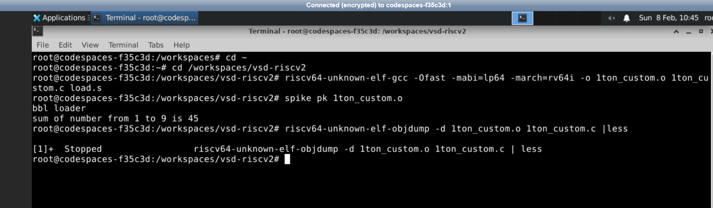

# Assambly code output:

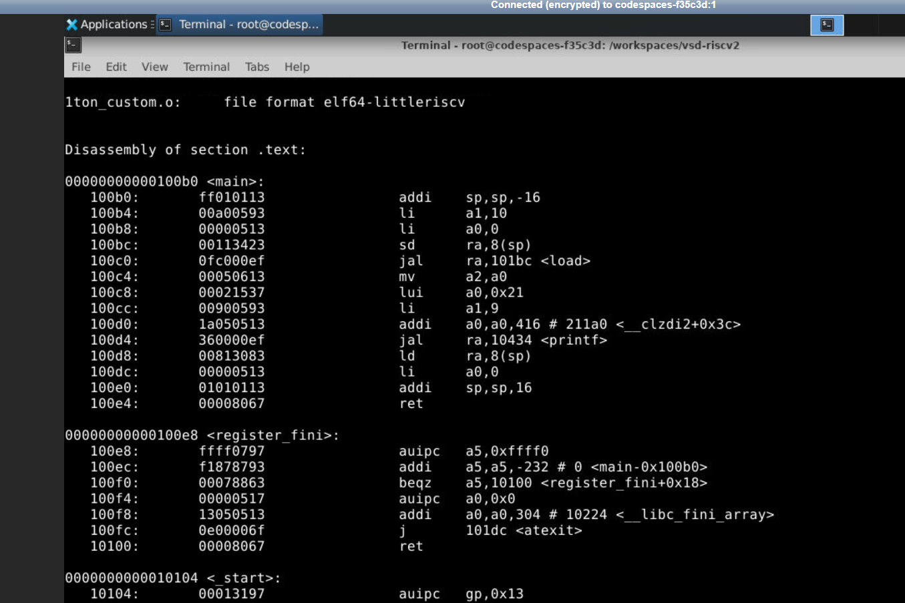

## Basic Verification Flow using Verilog

# Program on Riscv CPU

# Clone the github link given by the workshop team
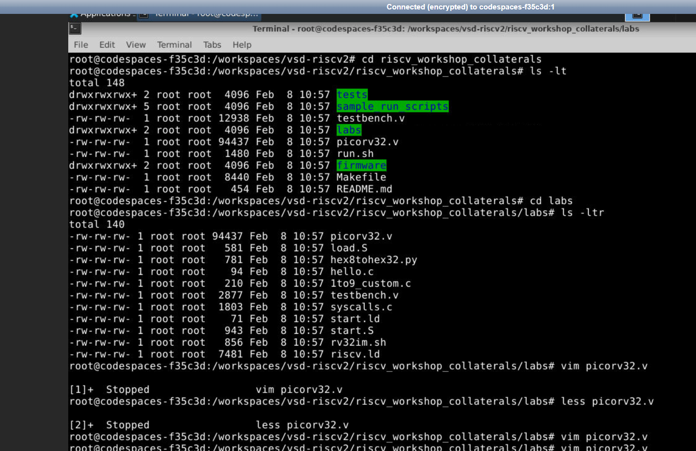

# Picorv32 program 

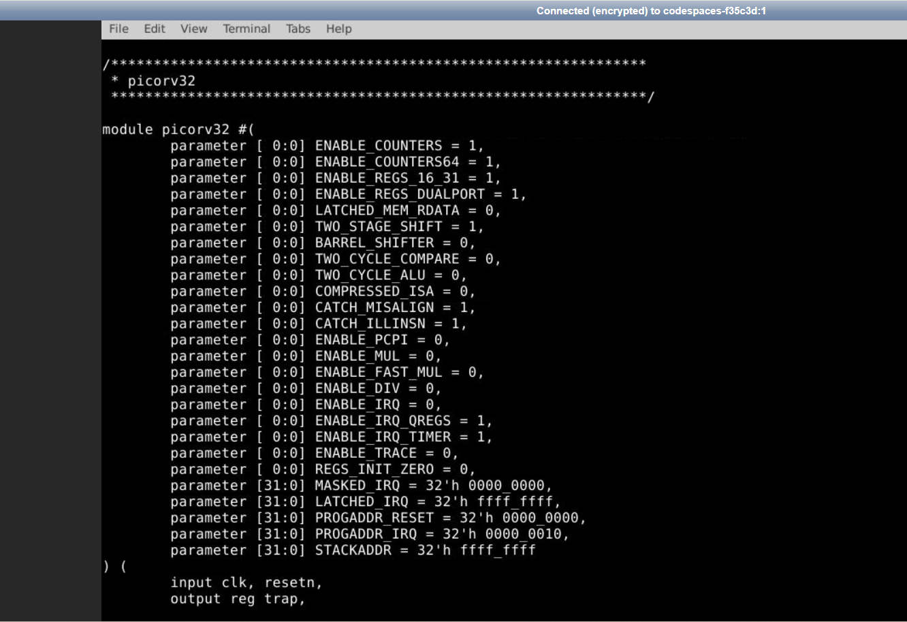

# Testbench Program

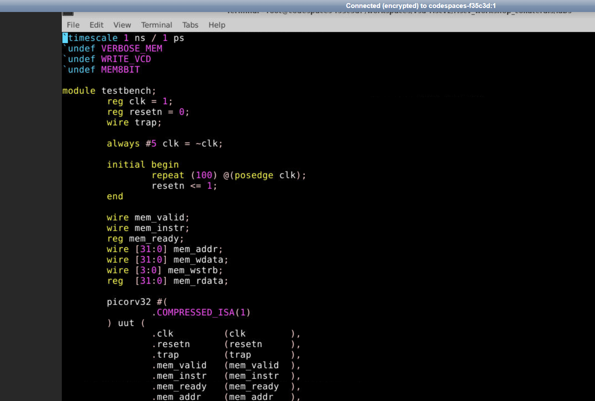

# hex file is converted to assembly language using the below program

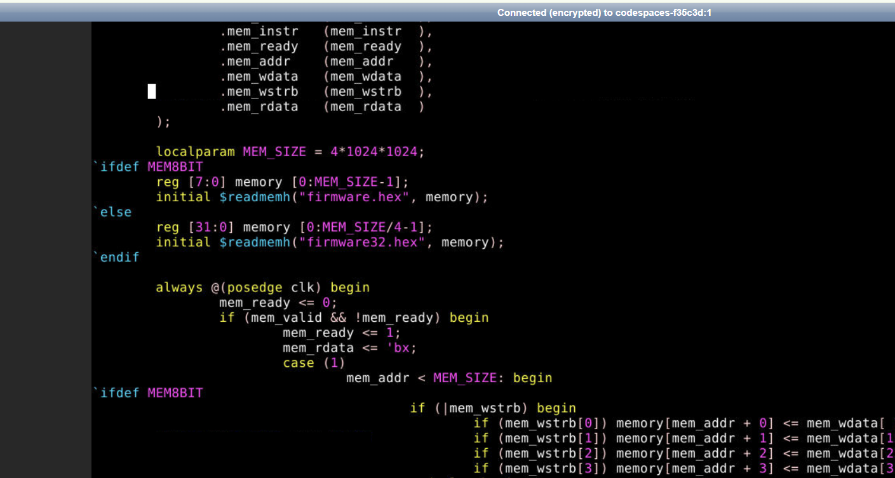

# These lines help us to see the Firmware hex and Firmware32 hex files

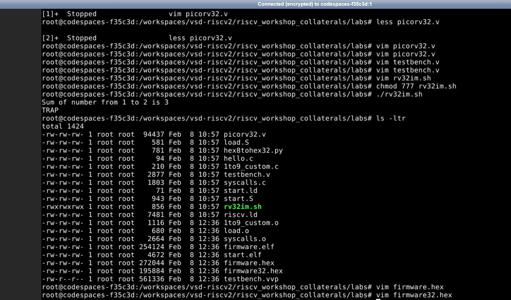

# firmware hex file

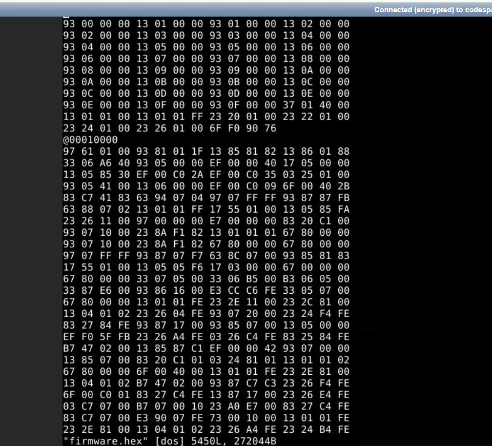

# firmware32 hex file

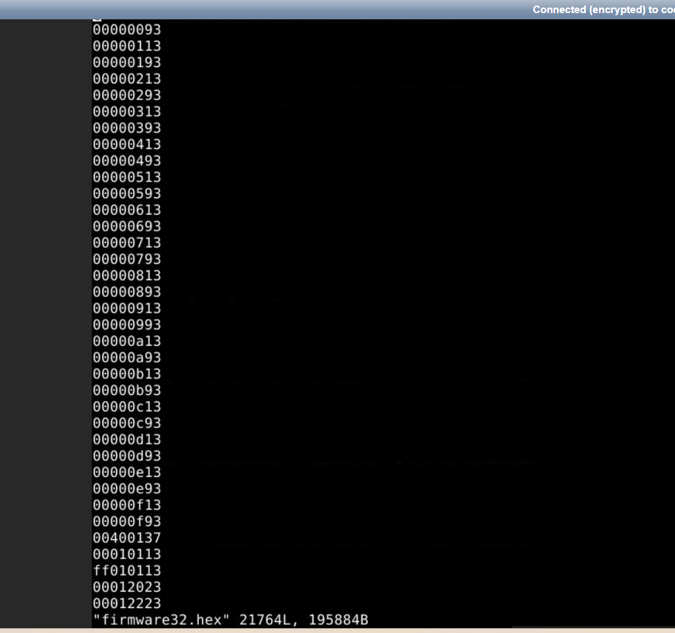
