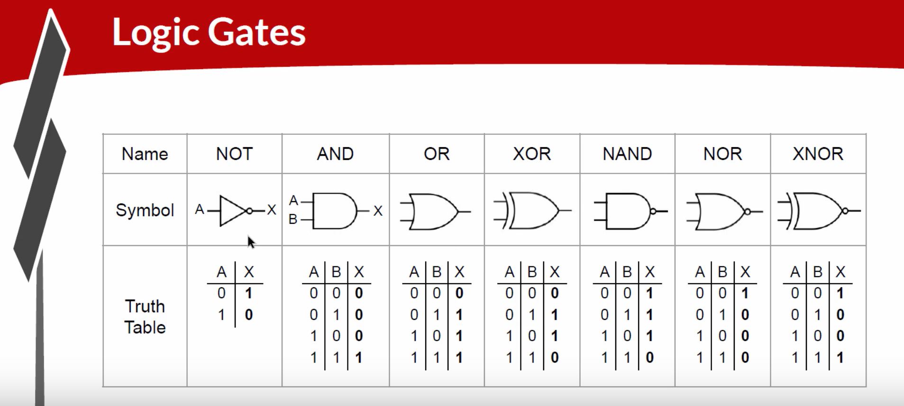
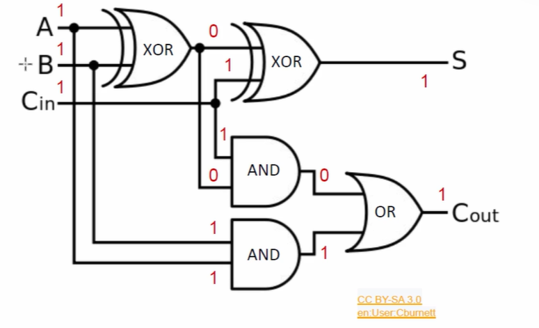
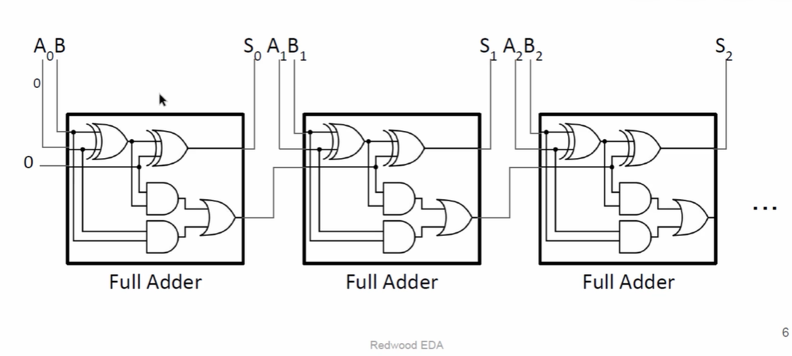
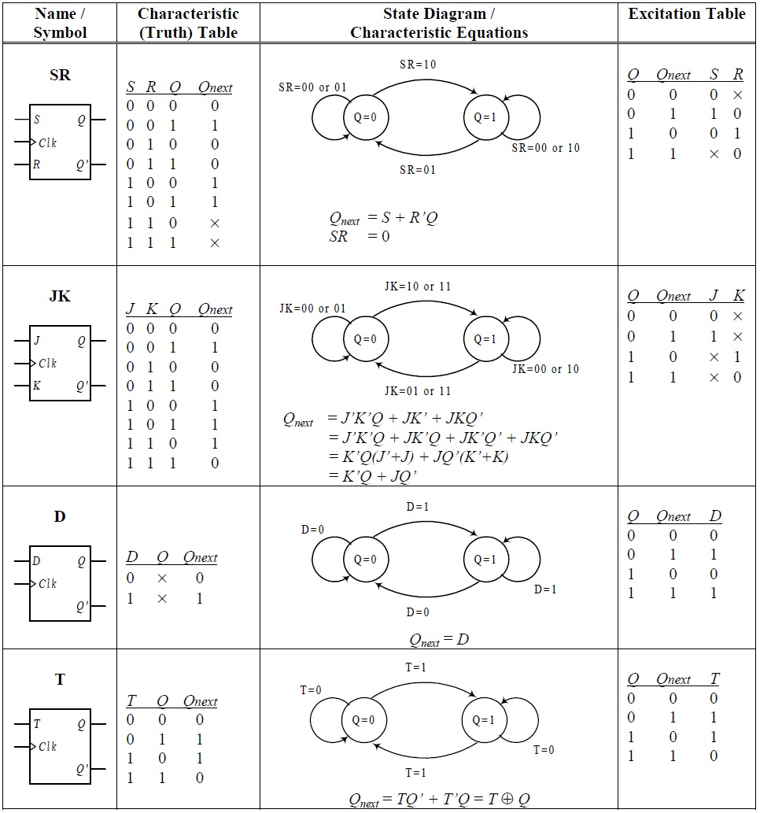
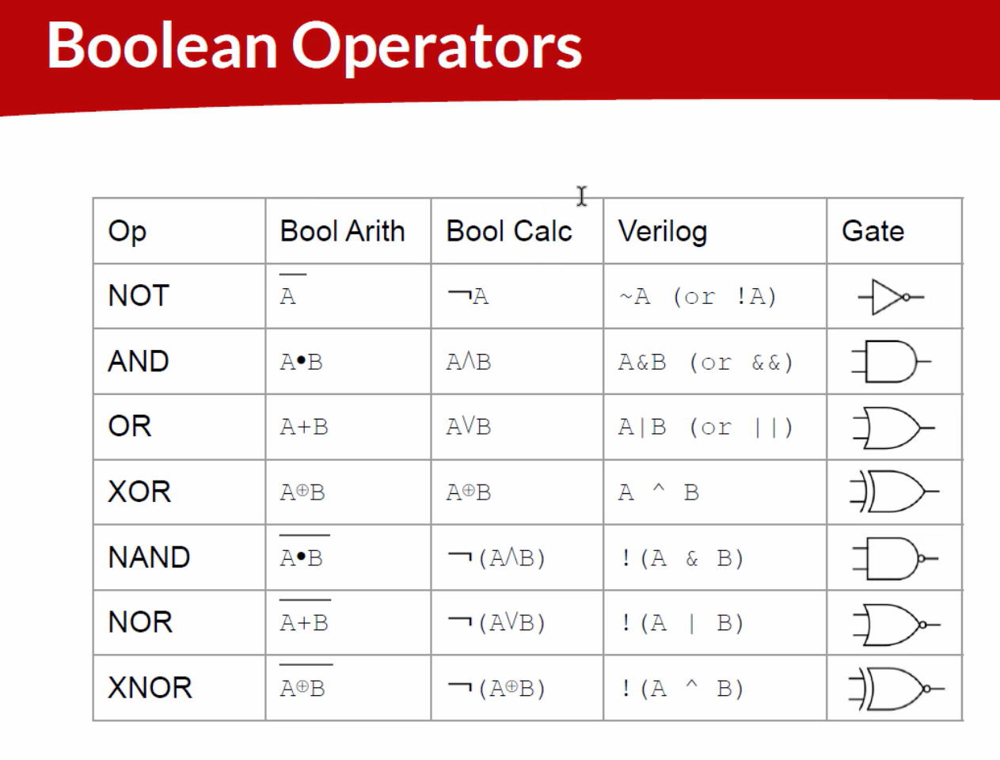
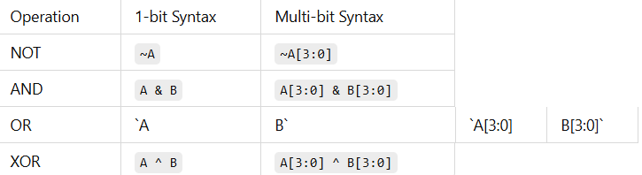

# Introduction to Logic gates

🚀 Digital Logic Fundamentals

Digital logic boils down to ones and zeros — the simplest form of information. Let’s explore how we manipulate these bits using logic gates.

### 🔧 Logic Gates

These are the core building blocks of all digital circuits. Each gate performs a basic logic function.

### 🔨 Combinational Logic

*Combinational logic circuits* produce outputs based solely on the current inputs. No memory or state is involved.

Example: Full Adder

Let’s build a simple 3-input full adder that computes:

Inputs: A, B, Cin (carry-in)

Outputs: S (sum), Cout (carry-out)

### ⏳ Sequential Logic

Unlike combinational logic, sequential circuits rely on clocks. This introduces state and allows data to flow through time.

Registers store values on clock edges

### 🛠️ Pipeline Logic

Pipeline logic distributes computation over multiple cycles, enhancing performance. Each stage processes part of the data, and outputs flow from stage to stage on clock edges.

### 🏗️ Hierarchical Design

We can build small modules (like the full adder) and reuse them as building blocks to create more complex circuits — think LEGO for hardware design!

### TL-Verilog Syntax Overview

Depending on whether you operate on 1-bit or multi-bit data, syntax may vary. Here’s a quick comparison:

