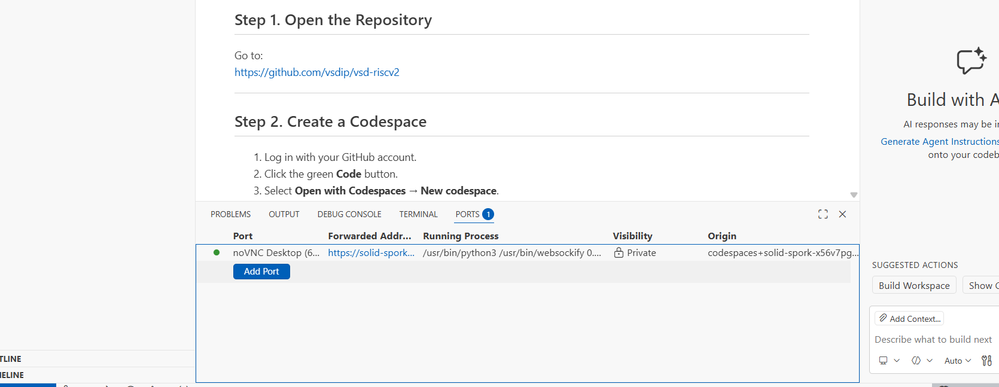
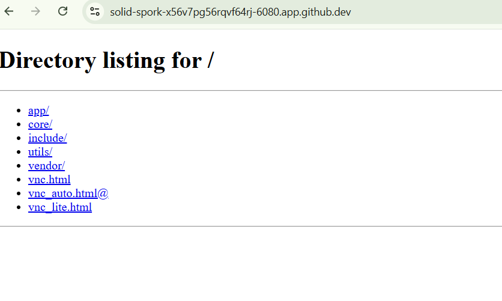
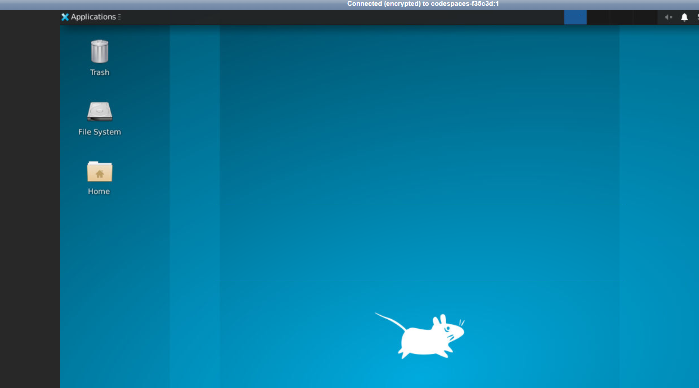
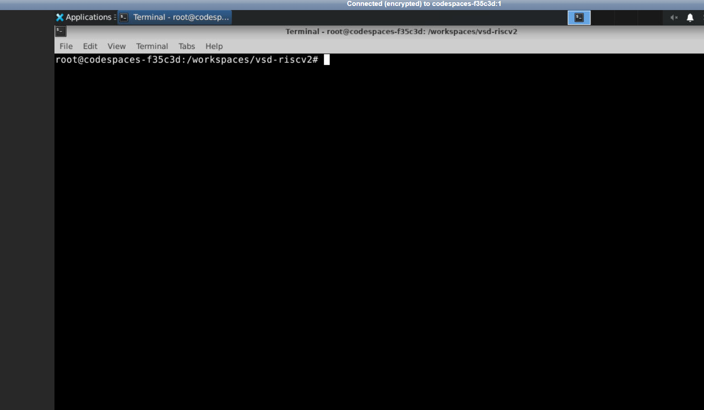
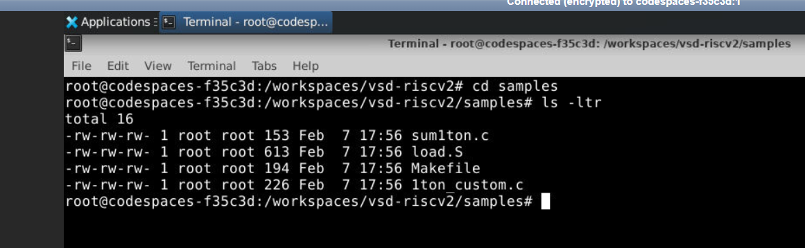
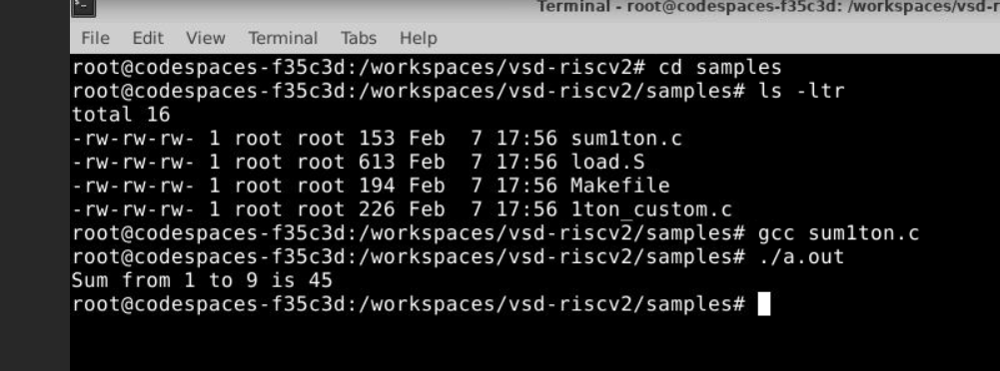
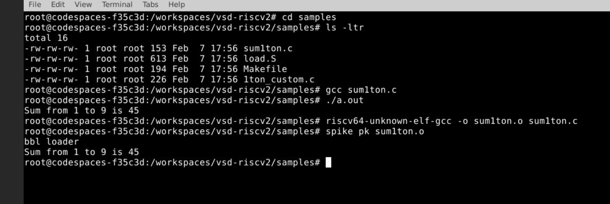
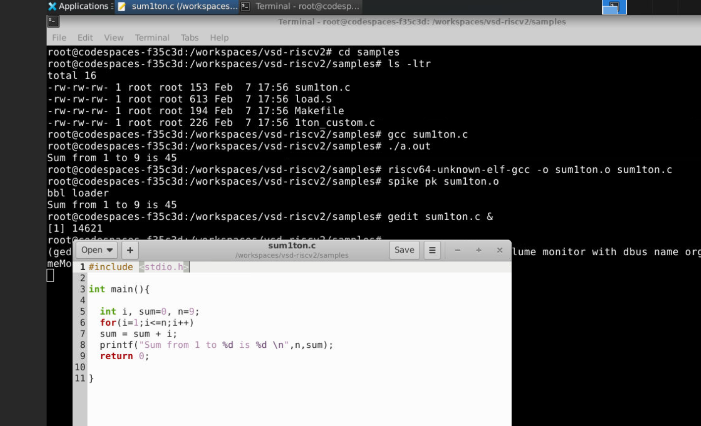

# NASSCOM-RISC-V-Based-LEARNING-Program
This repository documents my learning and hands-on work from the 10 Days RISC-V MYTH Workshop by VLSI System Design (VSD), covering RISC-V architecture, RTL design, Verilog implementation, simulation, synthesis, and use of open-source EDA tools through daily labs and notes.
## About Author

**Name:** N Tanishka Yadav

**Email ID:** tanishkaleninyadavnaganaboina@gmail.com

This hands-on learning experience introduces you to the world of digital logic design using **TL-Verilog**, an advanced design language created by **Redwood EDA**. Through the **Makerchip online platform**, we will build, test, and visualize digital circuits in an intuitive way. Starting from core basics, the sessions steadily advance to cover more complex and powerful concepts.

---

### Workshop Schedule


| Day | Topic                                    | Subparts                              |
| --- | ---------------------------------------- | ------------------------------------- |
| 1   | Introduction to RISC-V ISA & GNU compiler toolchain | [RISC-V Basic keywords](https://github.com/tanishkalenin/riscv-myth-10days-journey/blob/main/riscvbasics.md) |
|     |                                          | [RISC-V software toolchain](https://github.com/tanishkalenin/riscv-myth-10days-journey/blob/main/riscvsoftware.md)      |
|     |                                          | [Integer number representation](https://github.com/tanishkalenin/riscv-myth-10days-journey/blob/main/integerrepresentation.md)       |
| 2   | ABI & Basic Verification Flow | [ABI Basics](https://github.com/tanishkalenin/riscv-myth-10days-journey/blob/main/ABIlab.md) |
|     |                                          | [ABI Labs](https://github.com/tanishkalenin/riscv-myth-10days-journey/blob/main/verification.md)      |
|     |                                          | [Basic Verification flow using iverilog](https://github.com/tanishkalenin/riscv-myth-10days-journey/blob/main/.md)       |
| 3   | Digital logic with TL-Verilog in Makerchip IDE | [Logic Gates](https://github.com/tanishkalenin/riscv-myth-10days-journey/blob/main/Logicgates.md)  |
|     |                                          | [Makerchip Platform](https://github.com/tanishkalenin/riscv-myth-10days-journey/blob/main/Makerchip_platform.md)    |
|     |                                          | [Combinational Logic](https://github.com/tanishkalenin/riscv-myth-10days-journey/blob/main/Combinational_ckts.md) |
|     |                                          | [Sequential Logic](https://github.com/tanishkalenin/riscv-myth-10days-journey/blob/main/Sequential_ckts.md) |
|     |                                          | [Pipelined Logic](https://github.com/tanishkalenin/riscv-myth-10days-journey/blob/main/pipelined_logic.md) |
|     |                                          | [Validity](https://github.com/tanishkalenin/riscv-myth-10days-journey/blob/main/Validity.md) |
| 4   | Coding a RISC-V CPU subset  | [Simple RISC-V Microarchitecture](https://github.com/tanishkalenin/riscv-myth-10days-journey/blob/main/riscvmicro.md)      |
|     |                                          | [Fetch & Decode](https://github.com/tanishkalenin/riscv-myth-10days-journey/blob/main/fetch%26decode.md) |
|     |                                          | [RISC-V Control logic](https://github.com/tanishkalenin/riscv-myth-10days-journey/blob/main/controllogic.md)      |
| 5   | Pipelining and completing your CPU | [Understanding CPU Pipelining](https://github.com/tanishkalenin/riscv-myth-10days-journey/blob/main/cpupipeline.md) |
|     |                                          | [Solutions to Pipeline hazzards](https://github.com/tanishkalenin/riscv-myth-10days-journey/blob/main/hazards.md)      |
|     |                                          | [Completing RISC-V Design](https://github.com/tanishkalenin/riscv-myth-10days-journey/blob/main/riscvfinal.md)       |

--- 

## In this workshop we have did the lab sessions using cloud. This is the best way to start the journey of **Learning the RISCV**


# Getting Started with RISC-V on GitHub Codespaces

Follow the steps below to set up and run programs in your own Codespace.

---

## Step 1. Open the Repository

Go to:  
the link given through mail

---

## Step 2. Create a Codespace

1. Log in with your GitHub account.
2. Click the green **Code** button.
3. Select **Open with Codespaces** → **New codespace**.
4. Wait while the environment builds. (First time may take 10–15 minutes.)

---

## Step 3. Verify the Setup

In the terminal that opens, type:

```bash
riscv64-unknown-elf-gcc --version
spike --version
iverilog -V
````

You should see version information for each tool.

---

## Step 4. Run Your First Program

1. Go to the `samples` folder.
2. Compile the program:

   ```bash
   riscv64-unknown-elf-gcc -o sum1ton.o sum1ton.c
   ```
3. Run it with Spike:

   ```bash
   spike pk sum1ton.o
   ```

Expected output:

```text
Sum from 1 to 9 is 45
```

---

## Step 5. Next Steps

* You can edit and run your own C programs.
* You can also try Verilog programs using `iverilog`.

---

# Working with GUI Desktop (noVNC) – Advanced

The following steps show how to use a full Linux desktop inside your Codespace and run the same RISC-V programs there.

---

## Step 6. Launch the noVNC Desktop

1. In your Codespace, click the **PORTS** tab.

2. Look for the forwarded port named **noVNC Desktop (6080)**.

3. Click the **Forwarded Address** link.

   

4. A new browser tab opens with a directory listing. Click **`vnc_lite.html`**.

   

5. The Linux desktop appears in your browser.

   

---

## Step 7. Open a Terminal Inside the Desktop

1. Right-click anywhere on the desktop background.
2. Select **Open Terminal Here**.

   

A terminal window will open on the desktop.

---

## Step 8. Navigate to the Sample Programs

In the terminal, go to the workspace and then to the `samples` folder:

```bash
cd /workspaces/vsd-riscv2
cd samples
ls -ltr
```

You should see files like `sum1ton.c`, `1ton_custom.c`, `load.S`, and `Makefile`.



---

## Step 9. Compile and Run Using Native GCC (x86)

First, compile and run the C program with the standard `gcc` compiler:

```bash
gcc sum1ton.c
./a.out
```

Expected output:

```text
Sum from 1 to 9 is 45
```



---

## Step 10. Compile and Run Using RISC-V GCC and Spike

Now compile the same program for RISC-V and run it on the Spike ISA simulator:

```bash
riscv64-unknown-elf-gcc -o sum1ton.o sum1ton.c
spike pk sum1ton.o
```

You will see the proxy kernel (`pk`) messages and then the program output.



---

## Step 11. Edit the C Program Using gedit (GUI Editor)

To edit the program using a graphical editor:

```bash
gedit sum1ton.c &
```

This opens `sum1ton.c` in **gedit** on the noVNC desktop.



Make changes (for example, change `n = 9;` to another value), save the file, and re-run:

```bash
riscv64-unknown-elf-gcc -o sum1ton.o sum1ton.c
spike pk sum1ton.o
```

---

You have now:

* Launched a full Linux desktop inside GitHub Codespaces
* Compiled and executed a C program with native GCC
* Compiled and executed the same program on a RISC-V target using Spike
* Edited and rebuilt the code using a GUI editor over noVNC

