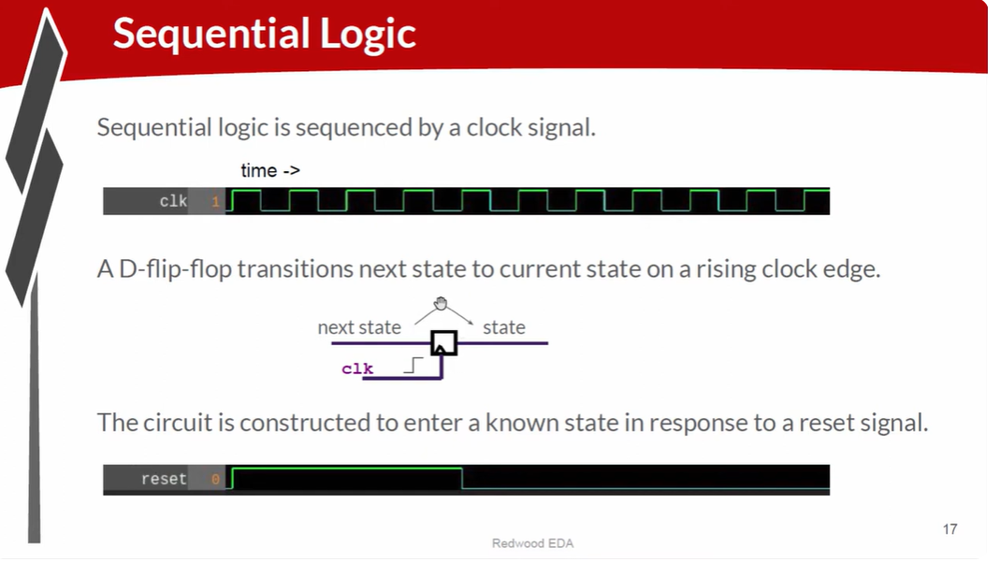
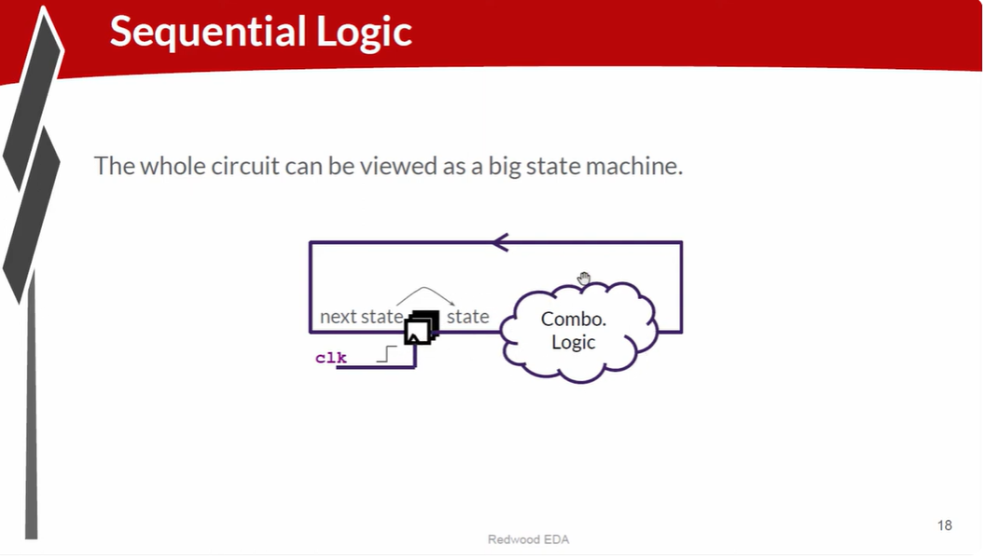
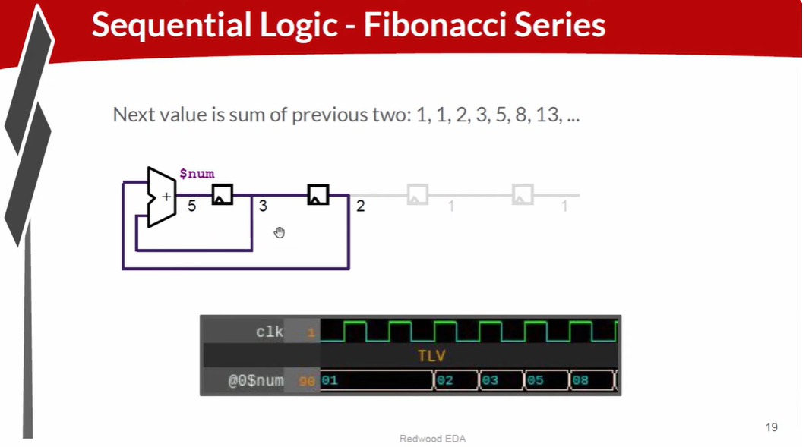
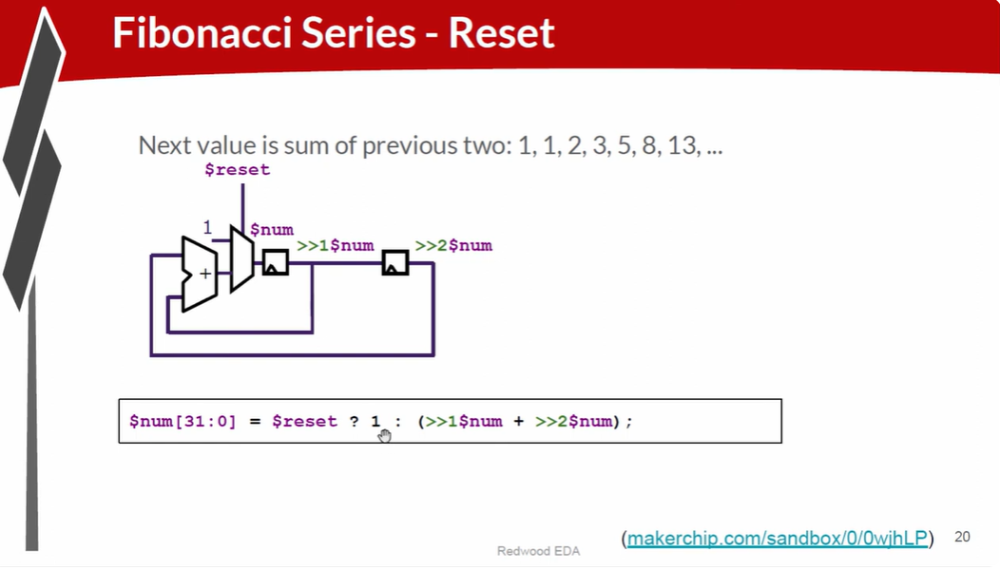
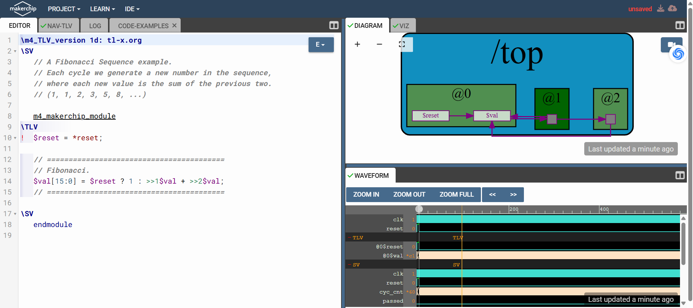
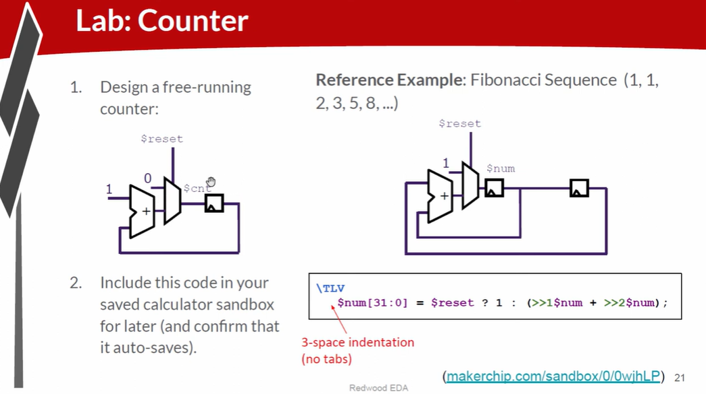
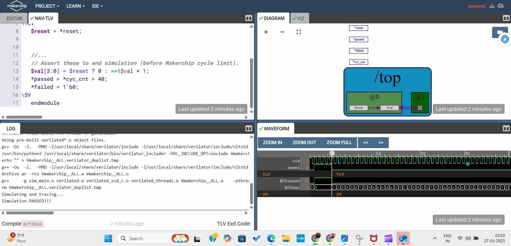
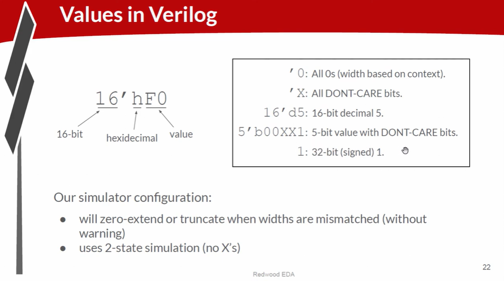
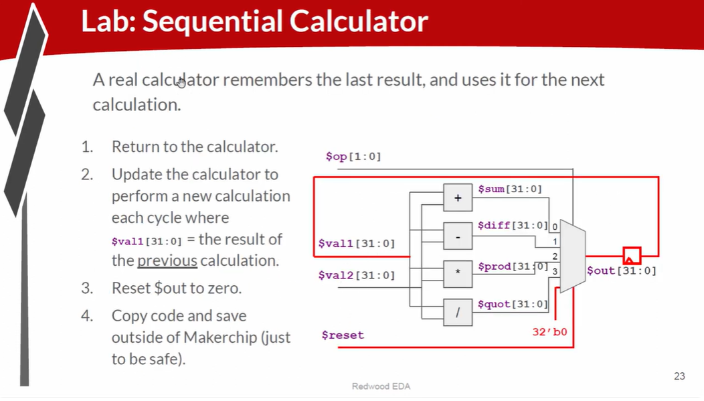

### Notes on Sequential Logic and D Flip-Flop

---

## 1. Introduction to Sequential Logic



- Sequential logic introduces the concept of a **clock** to control and sequence operations.
- The clock determines **when data is sampled and propagated**, making system behavior predictable.
- Unlike combinational logic, sequential logic depends on both **current inputs** and **previous states**.

---

## 2. D Flip-Flop

- The **D (Data) Flip-Flop** is the simplest and most commonly used flip-flop.
- It stores **one bit of data** (either `0` or `1`).
- On the **rising edge of the clock**, the input value `D` is transferred to the output `Q`.
- The output remains constant until the next active clock edge.
- Flip-flops act as **memory elements** in digital systems.

---

## 3. Importance of Reset in Sequential Circuits

- A **reset signal** initializes the circuit into a known state.
- This is essential during:
  - System startup
  - Rebooting
  - Error recovery
- Many flip-flops include a reset input that forces the output to `0` or `1`.
- After reset is deasserted, normal sequential operation resumes.

---

## 4. Sequential Circuits as State Machines



- Sequential circuits can be modeled as **finite state machines (FSMs)**.
- The **current state** is stored in flip-flops.
- **Combinational logic** computes the **next state** based on:
  - Current state
  - Inputs
- With every clock cycle:
  - The state updates
  - The circuit performs new computations

---

## 5. Fibonacci Series Circuit Example



- The Fibonacci series is defined as:
  - `F(n) = F(n-1) + F(n-2)`
- The circuit:
  - Stores two previous values in flip-flops
  - Adds them on each clock cycle
- The computed sum becomes the next Fibonacci number.

---

## 6. Reset in Fibonacci Circuit



- Reset injects **initial seed values** into the circuit.
- These values start the Fibonacci sequence.
- When reset is asserted:
  - Flip-flops are loaded with predefined values (typically ones).

---

## 7. TL-Verilog Representation of Fibonacci Circuit



- TL-Verilog expresses sequential behavior using **time-shift operators**.
- `>>1` refers to the previous cycle value.
- `>>2` refers to the value two cycles ago.
- Logic:
  - If reset is asserted → inject `1`
  - Else → compute sum of previous two values

---

# Labs

## 8. Exercise: Free-Running Counter



- A free-running counter:
  - Starts at zero
  - Increments by `1` every clock cycle
- No external enable signal is required.



---

## Expressing Values in Verilog

### 1. Verilog Value Notation



- Hardware values have **explicit bit widths**.
- Verilog syntax:
<bits>'<base><value>

- Bases:
- `d` → decimal
- `h` → hexadecimal
- `b` → binary
- Examples:
- `8'd15` → 8-bit decimal 15
- `4'b1010` → 4-bit binary 1010

---

### 2. Shortcuts in Verilog

- `'0` allows the tool to infer required bit width.
- `x` represents a **don't-care / unknown** value.
- Useful for debugging, as unknowns propagate through logic.

---

### 3. Handling Values Without Bit Width

- If no width is specified:
- Verilog assumes **32-bit integer**
- Suitable for simple arithmetic but risky for precise hardware design.

---

### 4. Synthesis and Simulation Considerations

- Synthesis and simulation tools may:
- Extend or truncate values automatically
- Makerchip with **Verilator**:
- Does not always warn about width mismatches
- Designers must explicitly manage bit widths.

---

### 5. Verilator Simulator

- Verilator is the simulator used by Makerchip.
- It supports **two-state simulation**:
- `0` and `1` only
- It does **not support `x` states**.

---

## Calculator Example with Flip-Flop (Sequential Circuit)



### 1. Enhancing the Calculator Circuit

- The calculator is extended to behave like a real calculator.
- It stores previous results for subsequent operations.

---

### 2. Sequential Logic with Flip-Flop

- A flip-flop stores the previous result.
- New computations use this stored value.
- Example:
- Stored value = 10
- New input = 2
- Next output = 12

---

### 3. Reset in Calculator Circuit

- Reset clears the stored value.
- Mimics the **Clear (C)** button of a calculator.
- After reset, computation restarts from zero.

---

### 4. Lab Exercise Solution (TL-Verilog)

```tlv
\m5_TLV_version 1d: tl-x.org
\m5

// =================================================
// Welcome! New to Makerchip? Try the "Learn" menu.
// =================================================

//use(m5-1.0)   /// uncomment to use M5 macro library.
\SV
m5_makerchip_module
\TLV
$reset = *reset;

// Sequential Calculator
$in1[31:0] = >>1$op;          // Memory element storing previous result
$in2[31:0] = $rand2[3:0];
$sel[1:0]  = $rand3[1:0];

$sum[31:0]  = $in1 + $in2;
$diff[31:0] = $in1 - $in2;
$prod[31:0] = $in1 * $in2;
$quot[31:0] = $in1 / $in2;

$temp[31:0] =
 (($sel == 2'b00) ? $sum  :
  ($sel == 2'b01) ? $diff :
  ($sel == 2'b10) ? $prod : $quot);

$op[31:0] = $reset ? 32'b0 : $temp;

*passed = *cyc_cnt > 40;
*failed = 1'b0;
\SV
endmodule
