# Pipelining


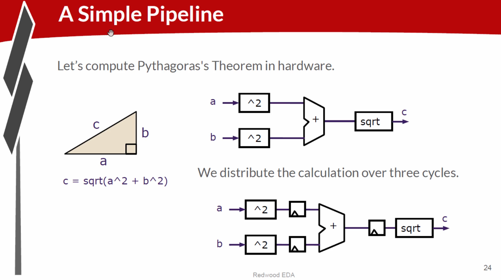


---

## Pipeline Logic and Hardware Computation  
### Pythagoras Theorem Example

---

## 1. Computation Goal: Pythagoras Theorem


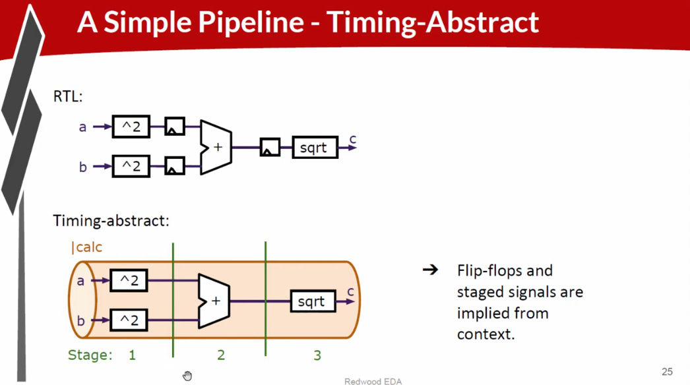


- The objective is to compute distance **c** using the Pythagoras theorem:

c = √(a² + b²)

- Hardware operations required:
- Square inputs `a` and `b`
- Add the squared results
- Compute the square root of the sum

- In modern processors (e.g., 1 GHz clock):
- Only a limited amount of logic (~20 gate levels) can be completed in one cycle
- Deeper logic paths must be split across multiple clock cycles

---

## 2. Pipeline Concept: Distributing Logic Across Clock Cycles


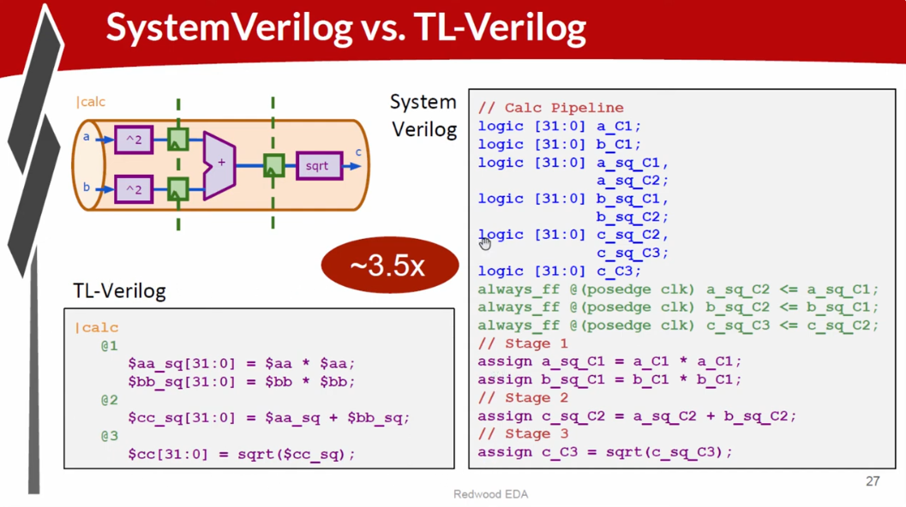


- Deep computations are broken into **pipeline stages**
- Each stage performs part of the computation and stores results in flip-flops

### Pipeline Stages

- **Cycle 1**
- Square `a` and `b`
- Store results in flip-flops

- **Cycle 2**
- Add `a² + b²`
- Store sum in flip-flops

- **Cycle 3**
- Compute square root of the sum  
*(Simplified to one cycle here)*

- Flip-flops ensure intermediate values are preserved across cycles

---

## 3. RTL Approach (Register Transfer Level)

- Traditional RTL explicitly defines:
- Combinational logic
- Flip-flops between stages

### RTL Characteristics

- Cycle-by-cycle control of:
- Squaring
- Addition
- Square-rooting
- Requires careful timing management
- Complex and error-prone for deep pipelines

---

## 4. TL-Verilog: Pipeline Abstraction

- TL-Verilog introduces **pipeline abstraction**
- Flip-flops between stages are **implicitly inferred**

### TL-Verilog Pipeline Example

- Define a pipeline named `calc`
- Declare stages:
- Stage 1
- Stage 2
- Stage 3
- Write logic per stage
- TL-Verilog automatically inserts flip-flops

### Benefits

- Focus on **what** the logic does, not **how** it is timed
- Reduced code
- Improved readability
- Fewer bugs


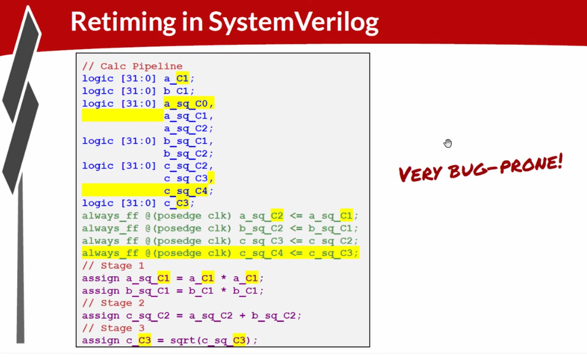


---

## 5. Timing Abstraction and Flexibility

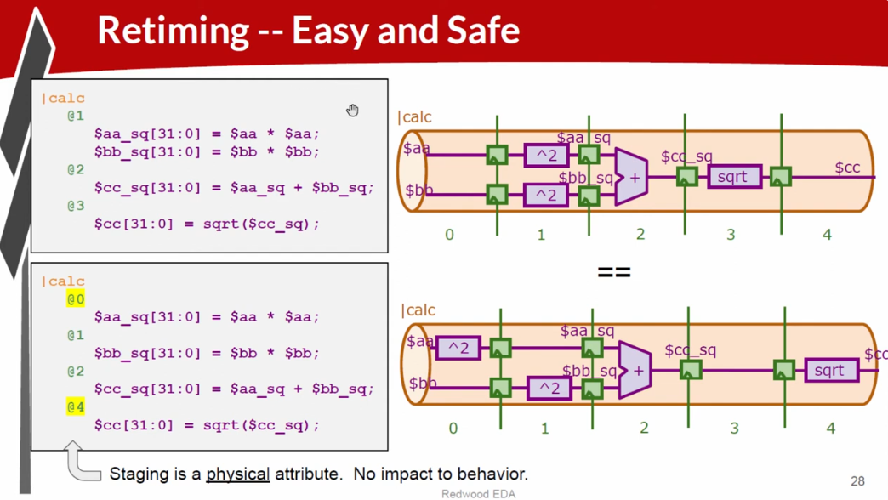

- **Function** and **timing** are separated
- Function: squaring, adding, square root
- Timing: pipeline stage placement

- Pipeline depth can be changed **without modifying logic**
- Traditional RTL requires rewiring flip-flops for timing changes

---

## 6. Why Adjust Pipeline Staging?

- Signals may travel long distances across a chip
- Propagation may require many clock cycles
- TL-Verilog allows:
- Adding pipeline stages
- Stretching timing
- Preserving functional behavior

---

## 7. Guarantee of Circuit Behavior

- Pipeline retiming preserves functional correctness
- Only timing changes
- Risk occurs only if data is consumed too early
- TL-Verilog minimizes timing-related bugs

---

## 8. Challenges in Traditional RTL

- Manual retiming
- Flip-flop rewiring
- High chance of bugs
- Time-consuming verification

- TL-Verilog simplifies this via pipeline abstraction

---

## Key Takeaways (Pipeline Logic)

- Pipelining breaks deep logic into manageable stages
- Enables higher clock frequencies
- TL-Verilog reduces RTL complexity
- Function and timing are cleanly separated

---

# Understanding Pipeline Benefits and Waveform Analysis

---

## 1. Pipelining for High Clock Frequency

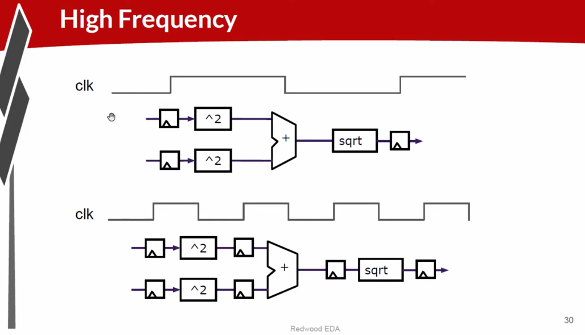

- Fast clocks require short logic paths
- Pipelining:
- Shortens logic depth
- Enables higher frequencies
- Accepts new inputs every cycle

---

## 2. Throughput vs Latency

- **Latency** increases with pipeline depth
- **Throughput** increases:
- New data every cycle
- More results per second

---

## 3. Pipeline Example: Pythagoras

- Stage 1: Square `a`, `b`
- Stage 2: Add squares
- Stage 3: Square root


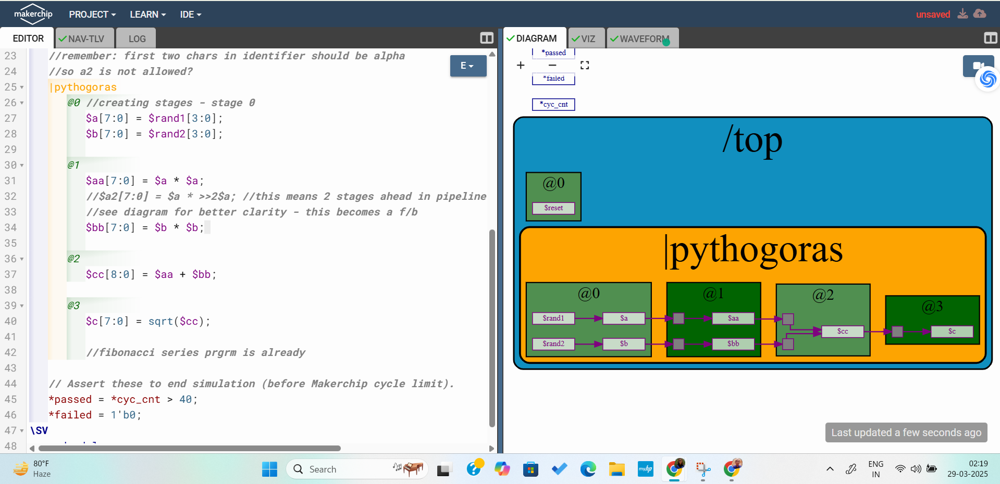


---

## 4. Waveform Viewer in Makerchip


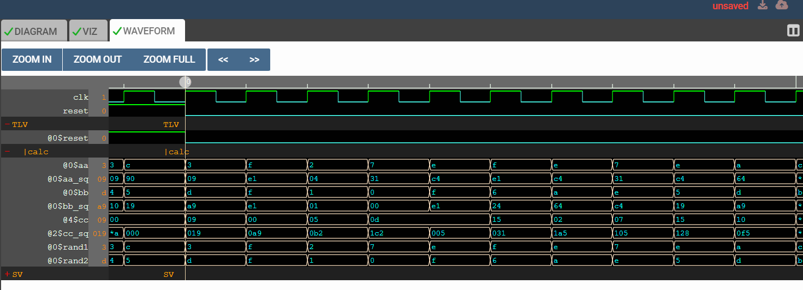


- Visualizes pipeline behavior over time
- Tracks data as it moves across stages
- Shows delayed output relative to inputs

---

## 5. Timing and Signal Alignment

- **Non-pipelined**:
- Inputs and output occur in same cycle
- **Pipelined**:
- Output appears several cycles later
- Flip-flops store intermediate values

---

## 6. Tagging Signals by Stage

- Signals are tagged by stage:
- `@1`, `@3`, etc.
- Helps trace signal flow and delays

---

## 7. Pipelining in TL-Verilog

- Signals automatically propagate through pipeline
- Flip-flops implied
- Each stage has its own SystemVerilog signal under the hood

---

## 8. Retiming Example

- Flip-flops repositioned to balance logic
- Improves timing without logic change

---

## 9. Sequential Logic and Feedback

- Feedback allows dependence on older values
- Example: Fibonacci
- Delayed signals (`a_4`, `a_12`) represent multi-cycle delays

---

## 10. Visualizing Feedback


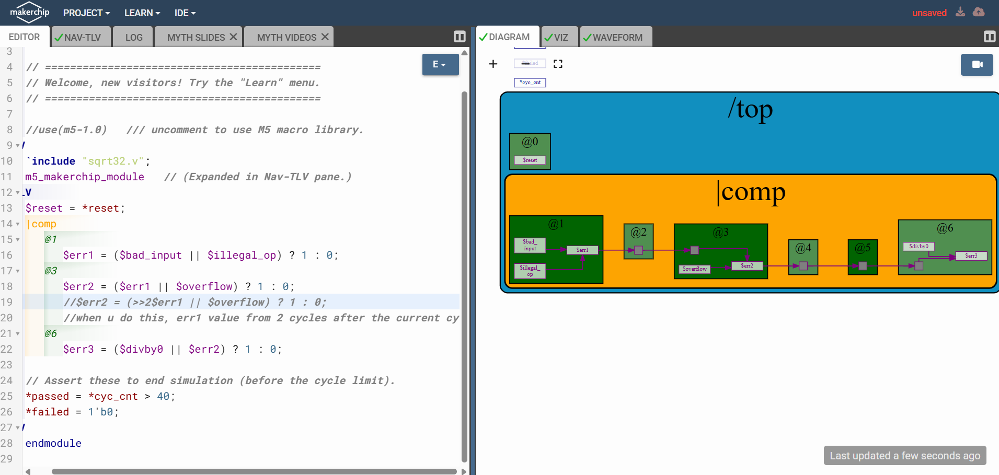


- Makerchip visualizes feedback loops
- Tracks multi-cycle signal flow

---

## 11. Benefits of Pipeline Diagrams

- Show implied flip-flops
- Clarify logic placement
- Aid debugging and verification

---

# TL-Verilog Syntax Basics

## Pipe Signals

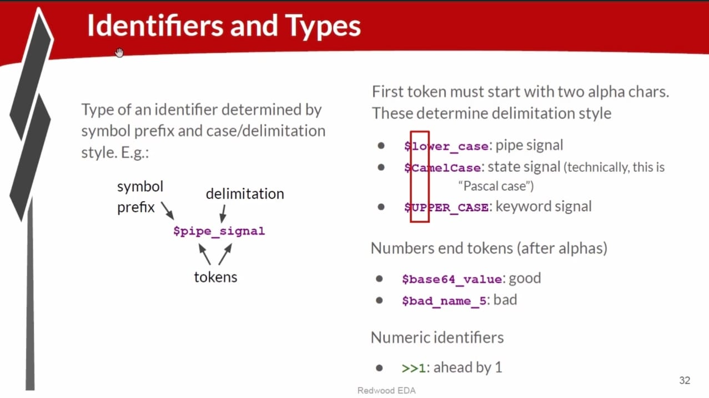

- Pipe signals:
- Lowercase
- Underscore-separated
- Example: `a_pipe_signal`

- State signals:
- PascalCase
- Example: `StateValue`

- Constants:
- Uppercase
- Example: `MAX_DEPTH`

- Numeric identifiers allowed at end of tokens

---

## Pipeline Stages in TL-Verilog

- Default stage: `@0`
- Explicit stage declaration: `@1`, `@2`, etc.
- Enables deep, multi-cycle pipelines

---

## Example: Fibonacci Pipeline

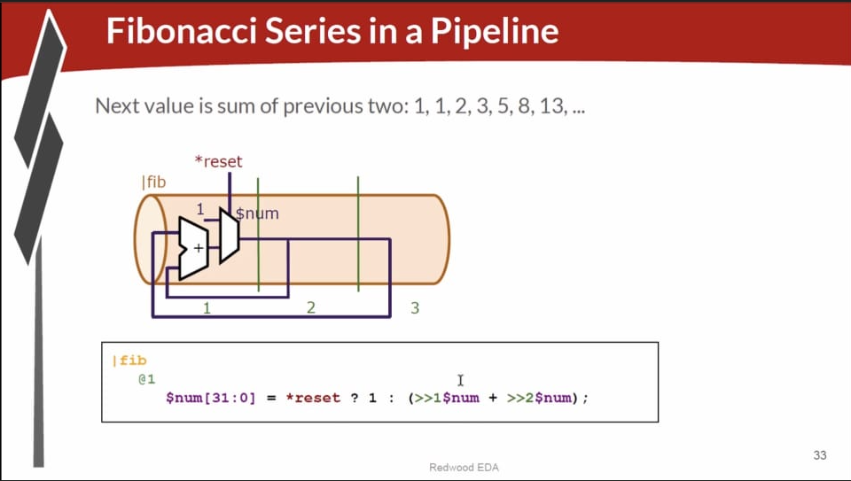

- Stage 1: Compute sum
- Stage 2: Store result
- Explicit staging improves scalability

---

## Error Handling in Deep Pipelines

```verilog
@1
$err1 = ($bad_input || $illegal_op) ? 1 : 0;

@3
$err2 = ($err1 || $overflow) ? 1 : 0;

@6
$err3 = ($divby0 || $err2) ? 1 : 0;

```


- Errors detected at multiple stages

- Aggregated via OR logic

- Verified using waveform viewer

## Pipeline Calculator Circuit Example
 
# Design Goals

- Calculator and counter in pipeline calc

- Stage 1 implementation

- High-frequency capable design

# Two-Stage Design

- Stage 1: Arithmetic operation

- Stage 2: Multiplexer selection

# Two-Cycle Latency

- Output looped back after two cycles

- Maintains iterative computation

# Valid Signal Logic

- Single-bit counter toggles valid cycles

- Invalid cycles output zero

- Reset clears pipeline state

# Expected Simulation Behavior

- Computation on even cycles

- Zero output on odd cycles

- Verified using waveform viewer

# Key Concepts Reinforced in This Example


   - **Pipeline Staging**: Dividing the computation into two pipeline stages allows the circuit to operate at **higher frequencies** by splitting the workload across clock cycles.


   - **Two-Cycle Latency**: The output is looped back with a two-cycle delay, reflecting the fact that the computation now takes two cycles to complete.

     
   - **Single-Bit Counter**: The use of a single-bit counter creates a simple oscillation to track which cycles are valid for computation.

     
   - **Valid Signal**: The **valid signal** ensures that computations only happen on designated cycles, and the circuit outputs zero during idle cycles.

     
   - **Multiplexer Re-Timing**: Moving the multiplexer to the second stage separates the operation from the selection, ensuring that timing constraints are met without overloading a single pipeline stage.


### LAB 


## PIPELINE 


## SIMPLE CALCULATOR


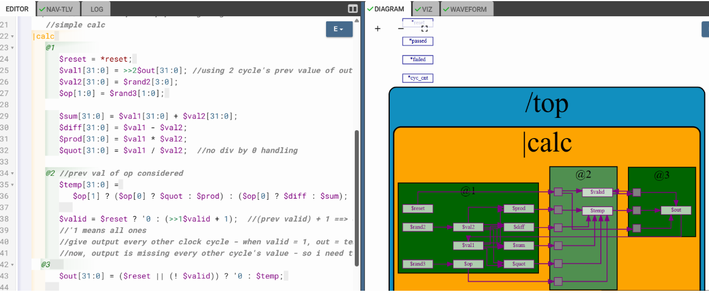


## CYCLIC CALCULATOR

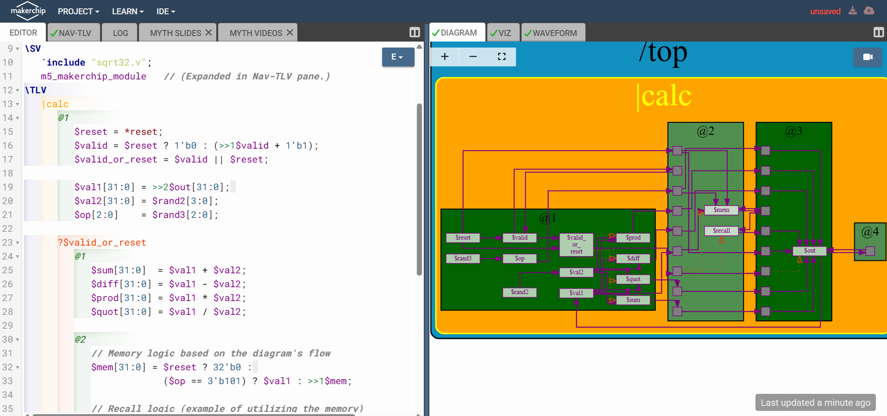
