## Step 1: Setting Up Ubuntu in VirtualBox (VMBox)

1. Install **Oracle VirtualBox**


2. Install **Ubuntu Linux**


3.Launch **VirtualBox** and click on the **New** button to create a new virtual machine. Fill
up the details as shown in the image below


4. Start the Ubuntu virtual machine and open the **Terminal**.


---

## Step 2: Installing Leafpad Text Editor

Install the lightweight text editor **Leafpad**, which is used to write C programs:

```bash
$ sudo apt install leafpad
```
Navigate to the home directory:
```
$ cd
```
```
$ leafpad sum1ton.c &
```

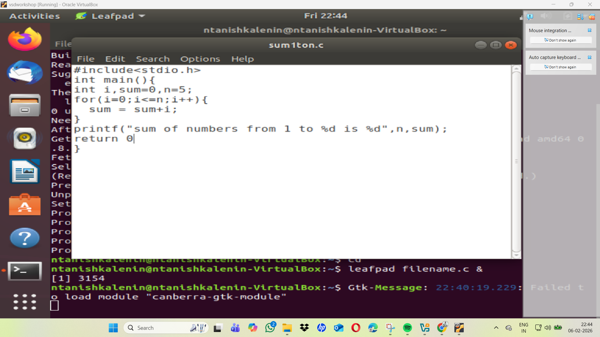

## Step 3: Compile and Run the C Code
Compile the C code:

```

$ gcc sum1ton.c

```
Run the compiled program:
```
$ ./a.out
```
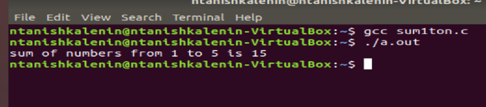


## Step 4: Compile C Code with RISC-V Compiler
Compile the C code using the RISC-V compiler:
```
$ riscv64-linux-gnu-gcc -O1 -march=rv64gc -o sum1ton.o sum1ton.c
```
List the compiled object file:

```
$ ls -ltr sum1ton.o
```
## Step 5: Display Assembly Code

Display the optimized assembly code for the main function:

```
$ riscv64-linux-gnu-objdump -d sum1ton.o
```

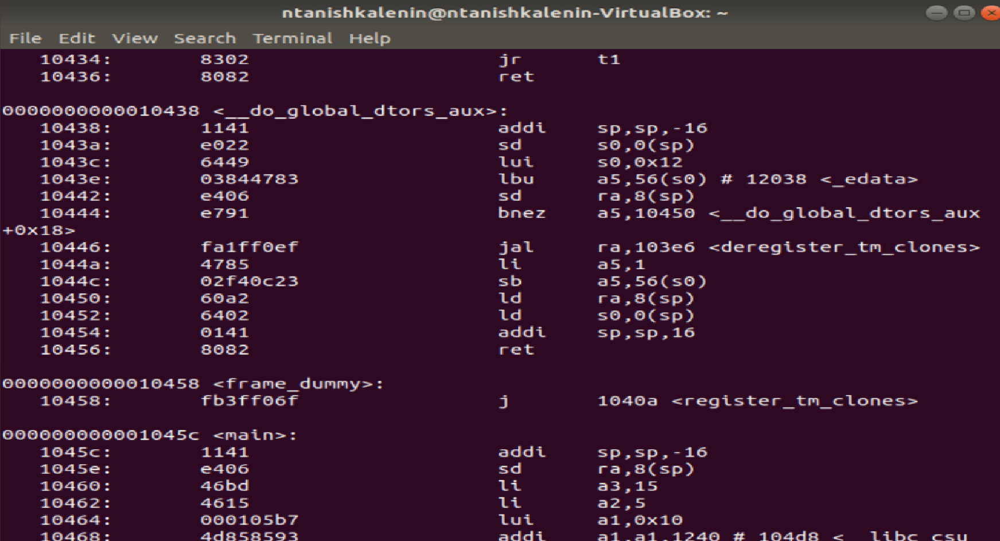

```
$ riscv64-linux-gnu-objdump -d sum1ton.o |less
```

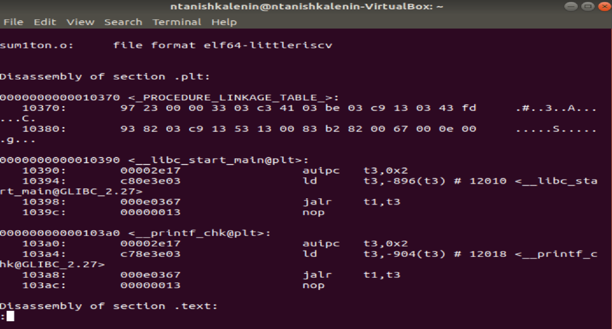

# signed and unsigned integers and spike and debug

compile the unsignedHighest.c program using RISC-V compiler
```
$ riscv64-unknown-elf-gcc -Ofast -mabi=lp64 -march=rv64i -o unsignedHighest.o unsignedHighest.c
```

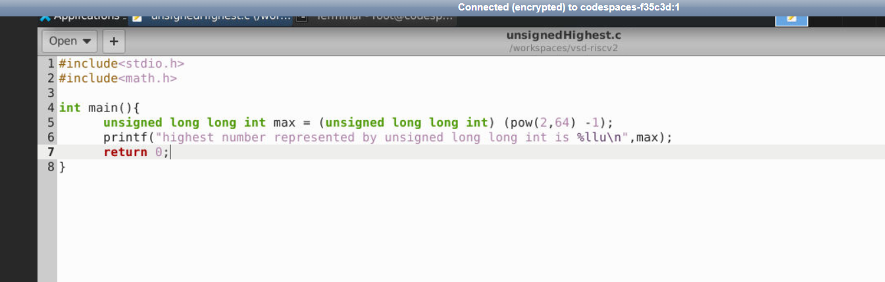

```
$ spike pk unsignedHighest.o

```

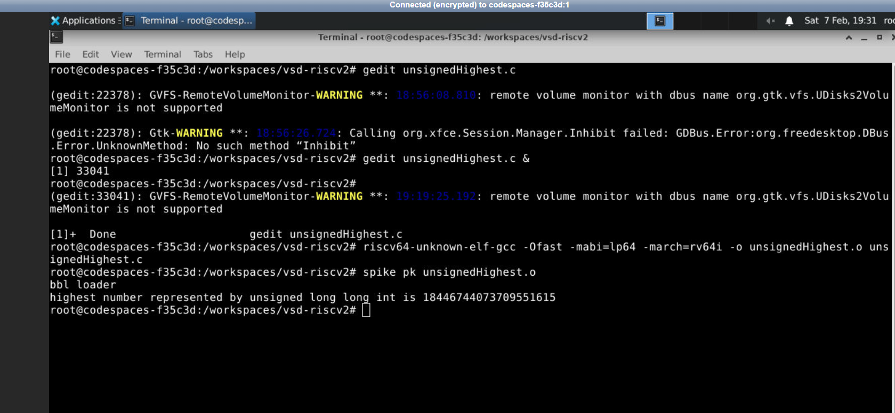

```
**2**
```
$ riscv64-unknown-elf-gcc -Ofast -mabi=lp64 -march=rv64i -o unsignedHighest.o unsignedHighest.c

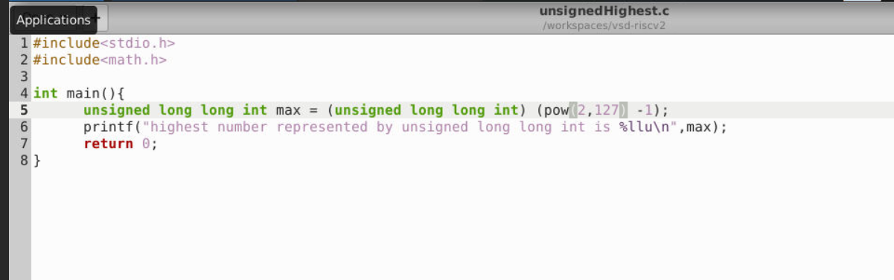

```
$ spike pk unsignedHighest.o

```

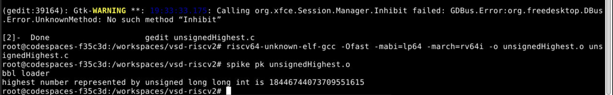

```
**3**
```
$ riscv64-unknown-elf-gcc -Ofast -mabi=lp64 -march=rv64i -o unsignedHighest.o unsignedHighest.c


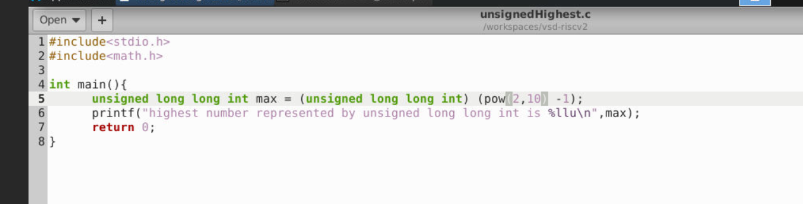

```
$ spike pk unsignedHighest.o
```

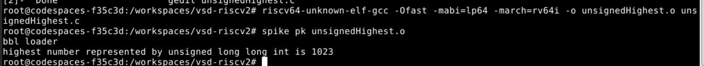

```

**signed**

$ riscv64-unknown-elf-gcc -Ofast -mabi=lp64 -march=rv64i -o signedHighest.o signedHighest.c
```

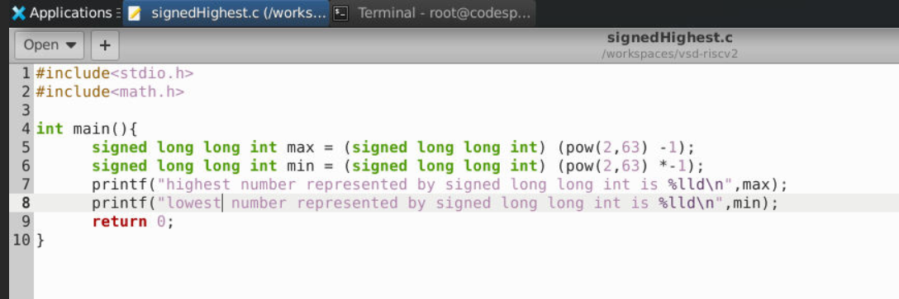

```
$ spike pk signedHighest.o

```
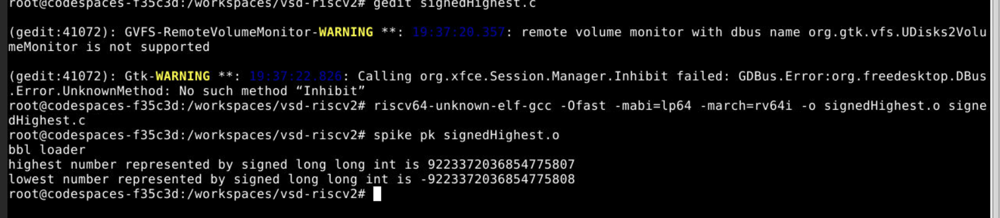
