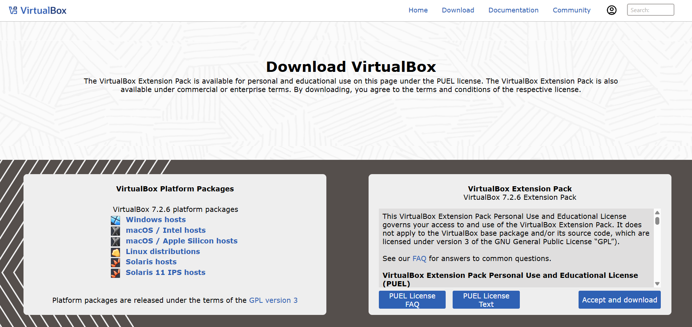
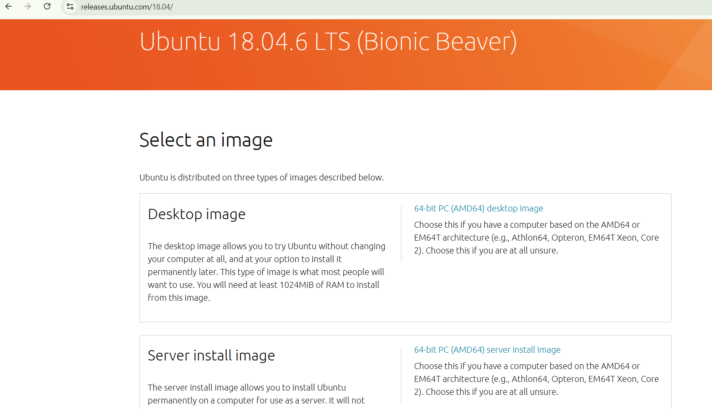

## Step 1: Setting Up Ubuntu in VirtualBox (VMBox)

1. Install **Oracle VirtualBox**


2. Install **Ubuntu Linux**


4. Start the Ubuntu virtual machine and open the **Terminal**.

---

## Step 2: Installing Leafpad Text Editor

Install the lightweight text editor **Leafpad**, which is used to write C programs:

```bash
$ sudo apt install leafpad
