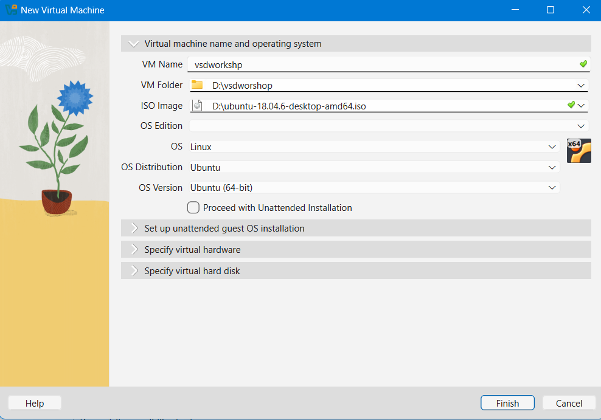
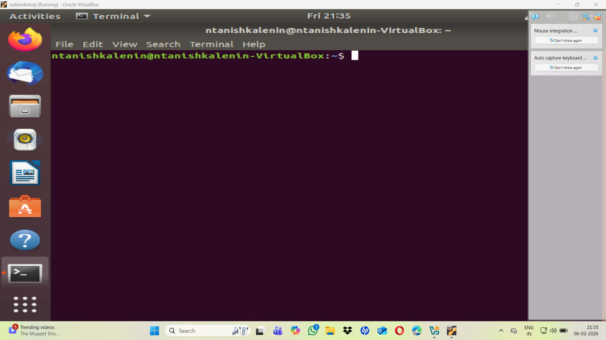

## Step 1: Setting Up Ubuntu in VirtualBox (VMBox)

1. Install **Oracle VirtualBox**


2. Install **Ubuntu Linux**


3.Launch **VirtualBox** and click on the **New** button to create a new virtual machine. Fill
up the details as shown in the image below



4. Start the Ubuntu virtual machine and open the **Terminal**.



---

## Step 2: Installing Leafpad Text Editor

Install the lightweight text editor **Leafpad**, which is used to write C programs:

```bash
$ sudo apt install leafpad
```
Navigate to the home directory:
```
$ cd
```
```
$ leafpad filename.c &
```


## Step 3: Compile and Run the C Code
Compile the C code:

```

$ gcc filename.c

```
Run the compiled program:
```
$ ./a.out
```


## Step 4: Compile C Code with RISC-V Compiler
Compile the C code using the RISC-V compiler:
```
$ riscv64-unknown-elf-gcc -O1 -mabi=lp64 -march=rv64i -o filename.o filename.c
```
List the compiled object file:

```
$ ls -ltr filename.o
```


## Step 5: Display Assembly Code


Display the optimized assembly code for the main function:

```
$ riscv64-unknown-elf-objdump -d filename.o | less
```


# Binary Neural Network in C


```c
int main(int argc, char* argv[])
{
    srand(0); // Use a fixed random seed for debugging.

    // Initialize layers.
    Layer* linput = Layer_create(NULL, 2);
    Layer* lhidden = Layer_create(linput, 3);
    Layer* loutput = Layer_create(lhidden, 1);
    Layer_dump(linput, stderr);
    Layer_dump(lhidden, stderr);
    Layer_dump(loutput, stderr);

    // Run the network.
    double rate = 1.0;
    int nepochs = 10000;
    for (int i = 0; i < nepochs; i++) {
        double x[2];
        double y[1];
        double t[1];
        x[0] = rnd();
        x[1] = rnd();
        t[0] = f(x[0], x[1]);
        Layer_setInputs(linput, x);
        Layer_getOutputs(loutput, y);
        Layer_learnOutputs(loutput, t);
        double etotal = Layer_getErrorTotal(loutput);
        fprintf(stderr, "i=%d, x=[%.4f, %.4f], y=[%.4f], t=[%.4f], etotal=%.4f\n",
                i, x[0], x[1], y[0], t[0], etotal);
        Layer_update(loutput, rate);
    }

    // Dump the finished network.
    Layer_dump(linput, stdout);
    Layer_dump(lhidden, stdout);
    Layer_dump(loutput, stdout);

    // Free the memory.
    Layer_destroy(linput);
    Layer_destroy(lhidden);
    Layer_destroy(loutput);
    return 0;
}
```


